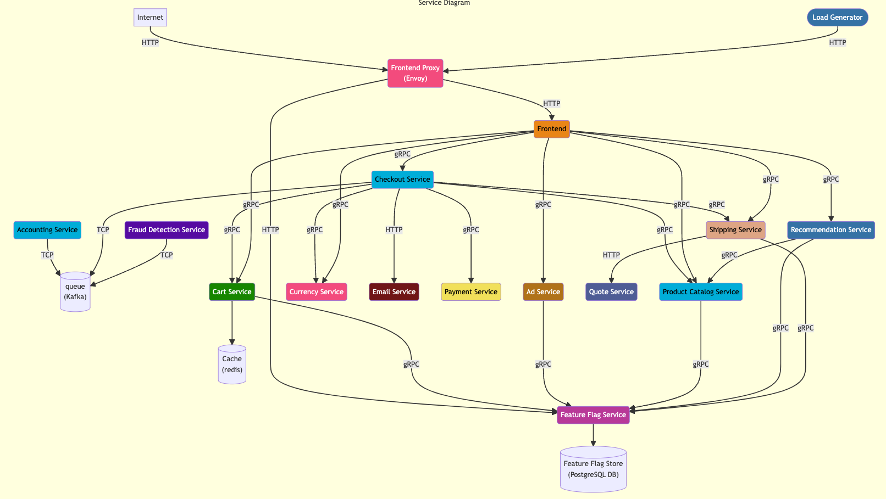
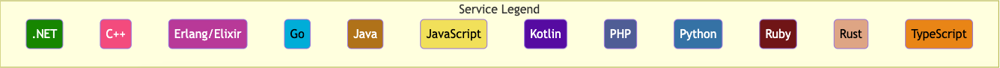
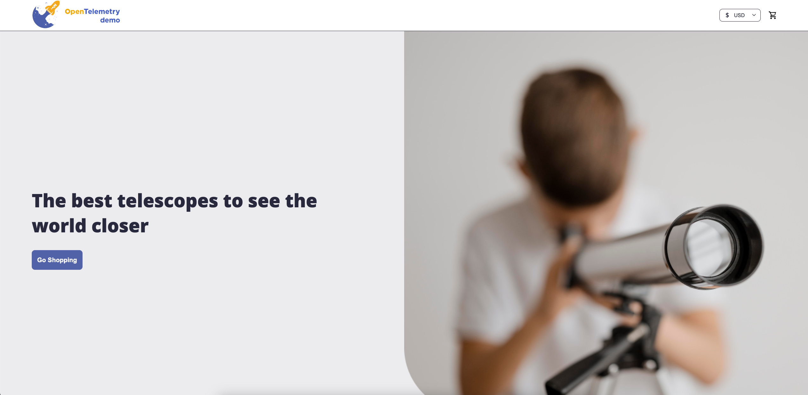

## Introduction
In this part you will be doing following tasks:
- Install OpenTelemetry Astronomy Shop Demo - App, Grafana, Jaegar and Locust
- Learn little bit about OpenTelemetry
- What is Observability?
- Access you Astronomy Shop

## Before we start
Create Caddy configuration:
```bash
cat > Caddyfile <<EOF
:8080 {

    @8080 {
        path /*
    }

    reverse_proxy @8080 127.0.0.1:8080

:8081 {

    @8089 {
        path /*
    }

    reverse_proxy @8089 127.0.0.1:8089
}

EOF
```

Clone workshop Git repository:
```bash
cd /root
git clone https://github.com/natilik/CLEU2024-DEVWKS-2713.git
```

## Install OpenTelemetry Astronomy Shop Demo
For the workshop we will use OpenTelemetry Astronomy Shop, a microservice-based distributed system intended to illustrate the implementation of OpenTelemetry in a near real-world environment. It is a perfect demo to demonstrate how OpenTelemetry works and what are the benefits.

We will use Helm to deploy OpenTelemetry Astronomy Shop on our dedicated Kubernetes cluster.

You can now add official Consul Helm chart:
```bash
helm repo add open-telemetry https://open-telemetry.github.io/opentelemetry-helm-charts
```

Now you can deploy Consul in your Kubernetes cluster using Helm:
```bash
helm install my-otel-demo open-telemetry/opentelemetry-demo
```

You can check the progress with the command:
```bash
kubectl get pods --all-namespaces -w
```

This can take few minutes. After OpenTelemetry Astronomy Shop is deployed we will go and explore little bit more about OpenTelemetry and Observability.

## Introduction into OpenTelemetry
OpenTelemetry is an open-source observability framework that standardizes the collection of distributed traces and metrics in modern, cloud-native applications. It provides a unified set of APIs, libraries, agents, and instrumentation to enable seamless monitoring, troubleshooting, and performance optimization across diverse software environments.

In very simple terms it means that OpenTelemetry will provide you vendor agnostic way to instrument and collect your data about your applications. In the past you usually had to use propriety agent or libraries that you had to run on top of your application but it can now be handled by open source SDKs/APIs and by OpenTelemetry collector.

## What is Observability?

Observability lets us understand a system from the outside, by letting us ask questions about that system without knowing its inner workings. Furthermore, it allows us to easily troubleshoot and handle novel problems (i.e. “unknown unknowns”), and helps us answer the question, “Why is this happening?”


Telemetry refers to data emitted from a system, about its behavior. The data can come in the form of traces, metrics, and logs.

### Traces
A distributed trace, more commonly known as a trace, records the paths taken by requests (made by an application or end-user) as they propagate through multi-service architectures, like microservice and serverless applications.

### Metrics
Metrics are aggregations over a period of time of numeric data about your infrastructure or application. Examples include: system error rate, CPU utilization, request rate for a given service. For more on metrics and how they pertain to OpenTelemetry, see Metrics.

### Logs
A log is a timestamped message emitted by services or other components. Unlike traces, however, they are not necessarily associated with any particular user request or transaction

### Spans
A span represents a unit of work or operation. It tracks specific operations that a request makes, painting a picture of what happened during the time in which that operation was executed.

## OpenTelemetry Astronomy Shop Demo Architecture

The application simulates a web shop using 15 different micro-services written 12 different programming languages. It uses a load generator (Locust) to continuously sends requests imitating user shopping flows to the frontend proxy.






Source: https://opentelemetry.io/docs/demo/architecture/

Before we will test the app let's make it accesible. Firstly we need to start Caddy.

```bash
cd /home/developer/src
caddy stop
caddy run
```

Now let's verify if the application was deployed properly by accessing it. Expose the application with `kubectl port-forward`:
```bash
kubectl port-forward services/my-otel-demo-frontendproxy 8080:8080
```


Now let's open the app. Link should look something like this: `https://app-8080-xxxx.devenv-testing.ap-ne-1.devnetcloud.com`.

You should see this:


