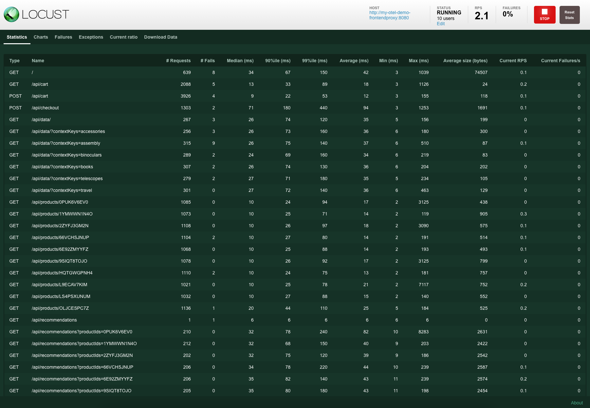
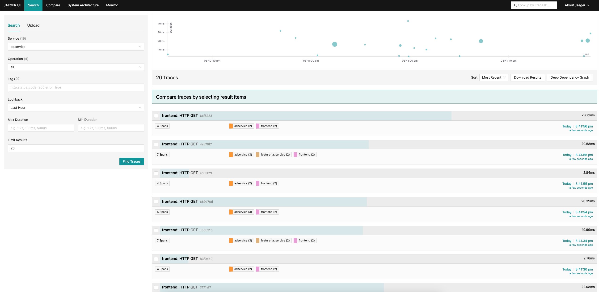
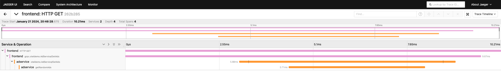
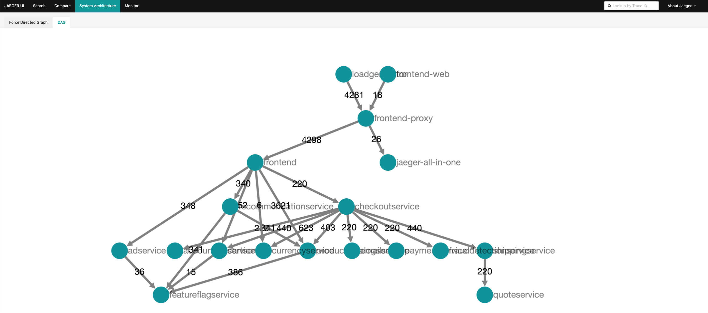
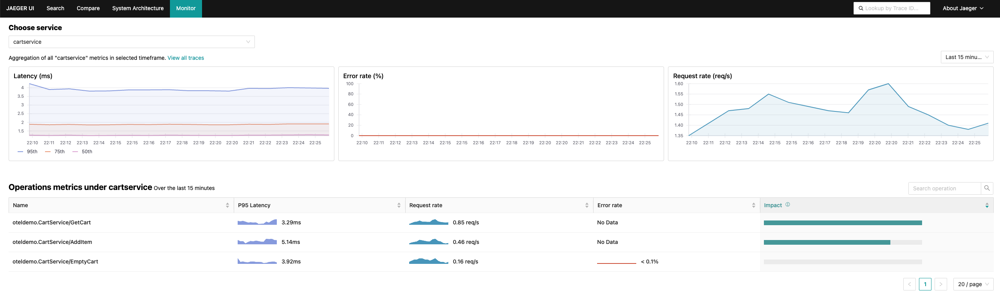
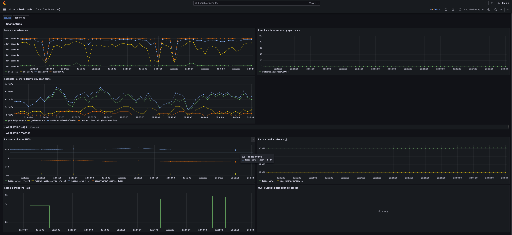
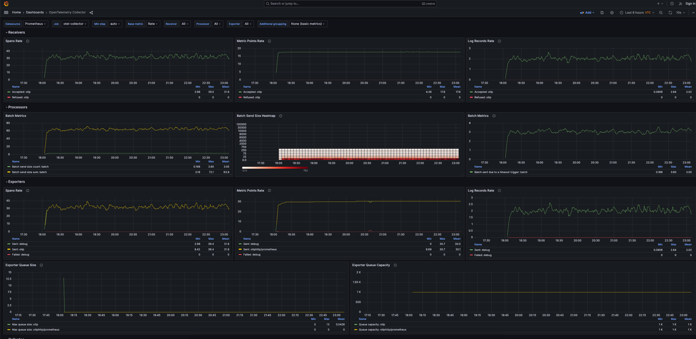
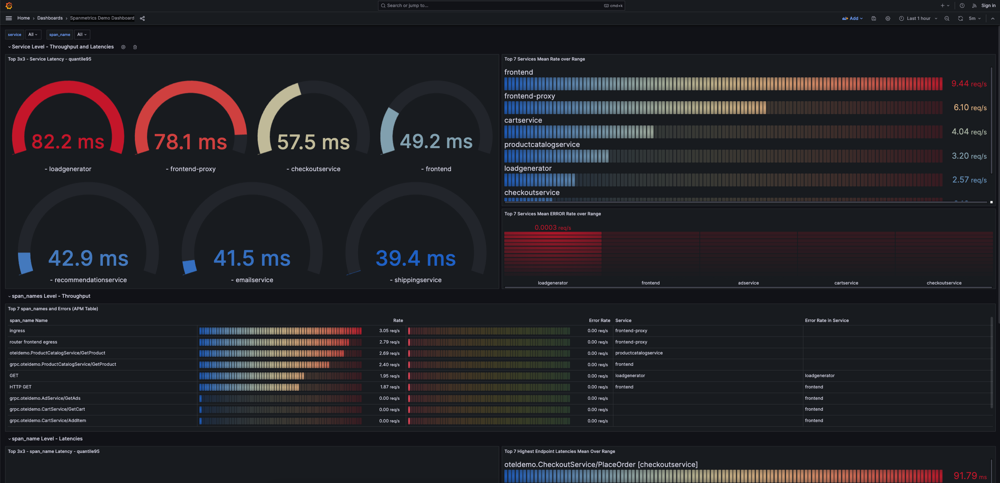

## Introduction
In this part you will be doing following tasks:
- Simulate user traffic with Locust
- Learn how to use Jaeger to understand traces
- Walk through Grafana and understand basic OpenTelemetry metric dashboard
- Learn how to use Feature flags

## Locust
Locust is an open-source, Python-based load testing tool that allows you to simulate and generate scalable user traffic for performance testing purposes. With Locust, you can easily create test scenarios to stress-test your applications and systems. 

We will have to make Locust make accessible via Caddy running this command:

```bash
kubectl port-forward svc/my-otel-demo-loadgenerator 8089:8089
```

Now let's open Locust. Link should look something like this: `https://app-8081-xxxx.devenv-testing.ap-ne-1.devnetcloud.com`.

You should see this:



You can see Locust is already running tests against OpenTelemetry Application.


## Jaeger 

Next tool we will use is Jaeger. Jaeger is an open-source, end-to-end distributed tracing system designed to monitor and troubleshoot complex microservices architectures. It plays a crucial role in OpenTelemetry demos by providing visibility into the flow of requests across different services. Jaeger enables users to trace the path of requests as they traverse through various components, helping to identify bottlenecks, latency issues, and dependencies within a distributed system.

Jaeger is basically the first tool you get in contact with when you start getting into the world of Distributed Tracing. With Jaeger, we can visualise the whole chain of events. With this visibility we can easier isolate the problem when something goes wrong.

The trace contains a list of spans in a parent-child relation that represent the order of execution along with the time taken by each span.

You can open Jaeger via `https://app-8080-xxxx.devenv-testing.ap-ne-1.devnetcloud.com/jaeger`

Let's quickly walk you through Jaeger. Let's start with traces for `adservice`. Select `adservice` from service list and click on "Find Traces". You should see list of traces. You should not see any errors in any of traces.



Click on the trace, to get detailed information from it. You will see that the trace consists of spans where each span represents an operation done by the services.

The trace contains a list of spans in a parent-child relation that represent the order of execution along with the time taken by each span. You can see the waterfall overview.



You can also use the Directed Acyclic Graph (DAG) graph to view the dependancies between the microservices. Click on "System Architecture" and then on "DAG". You should see the diagram below.



Surfaced in Jaeger UI as the “Monitor” tab, the motivation for this feature is to help identify interesting traces (e.g. high QPS, slow or erroneous requests) without needing to know the service or operation names up-front.

It is essentially achieved through aggregating span data to produce RED (Request, Error, Duration) metrics.




## Grafana
Grafana is an open-source platform used for monitoring and observability, allowing users to visualize and analyze metrics and logs in real-time. We will be using Grafana to view various metrics - application metrics, OpenTelemetry collector metrics and span metrics.

Let's start with application metrics. Go to `https://app-8080-xxxx.devenv-testing.ap-ne-1.devnetcloud.com/grafana/dashboards` and choose "Demo Dashboard". You should see application metrics which provides more detail on how each service is performing including resources. In the top right corner you can choose what service you want to analyze.



Next is OpenTelemetry Collector dashboard which will provide you more general information about the collector and data which is collecting from multiple different resources. It provide you more detail in what rate collector recieves and export the data.



Last Dashboard "Spanmetrics Demo Dashboard" gives more insight on spans data. It follows RED (Request, Error, Duration) methodology which we have seen in case of Jaeger Monitor dashboard.




## Feature flags
Feature flags allow developers to control the visibility and activation of specific features in an application. In our workshops we will use feature flags to simulate scenarios. We will be for instance injecting errors or a memory leak. To access feature flags got to `https://app-8080-xxxx.devenv-testing.ap-ne-1.devnetcloud.com/feature`. Now, let's simulate some of those scenarios.