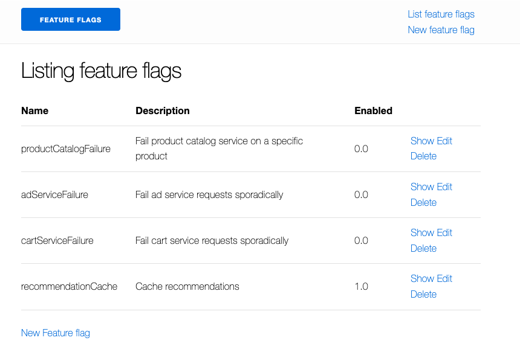
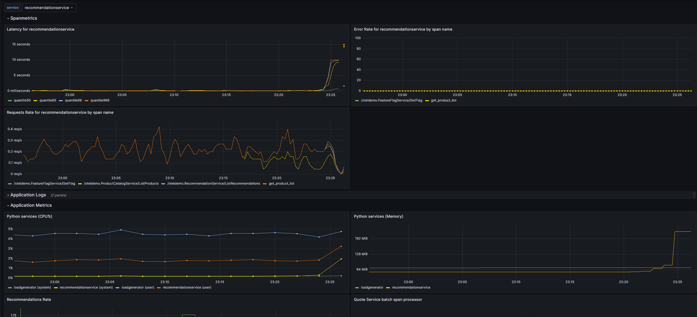
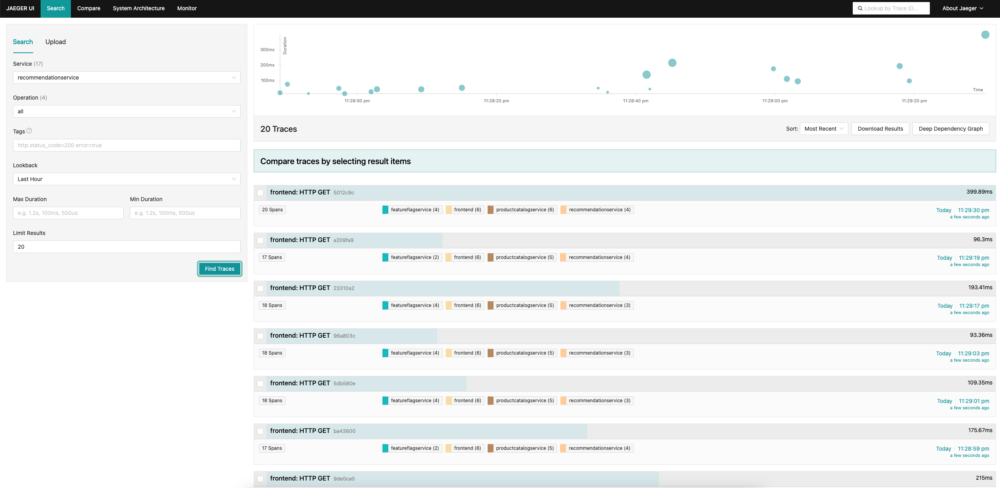
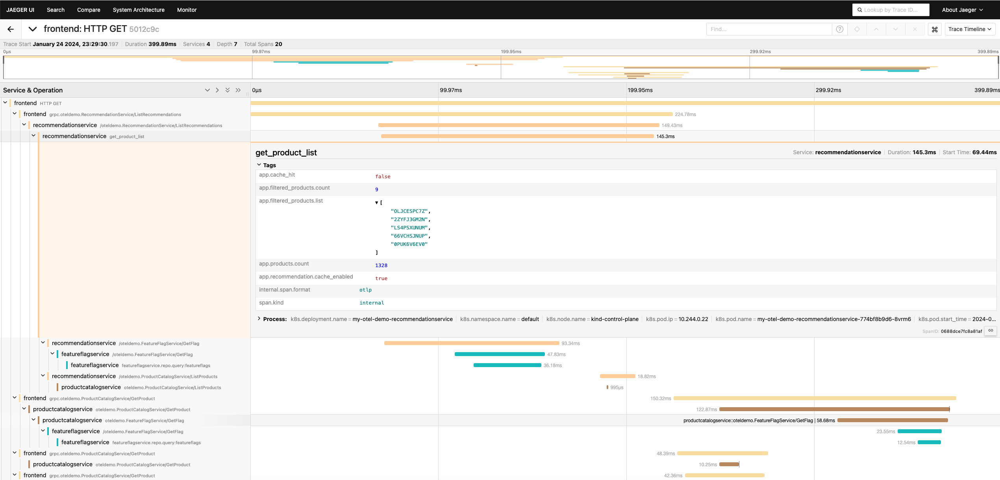
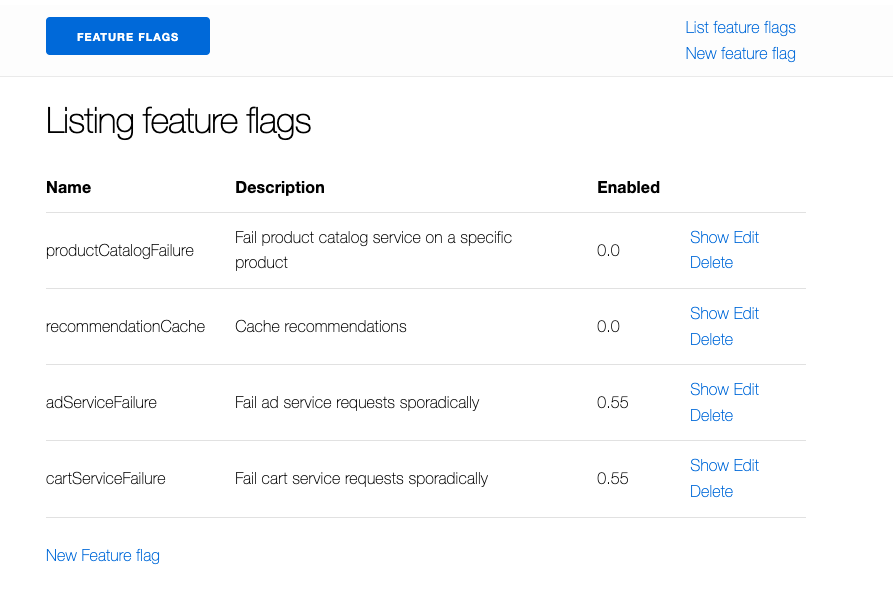
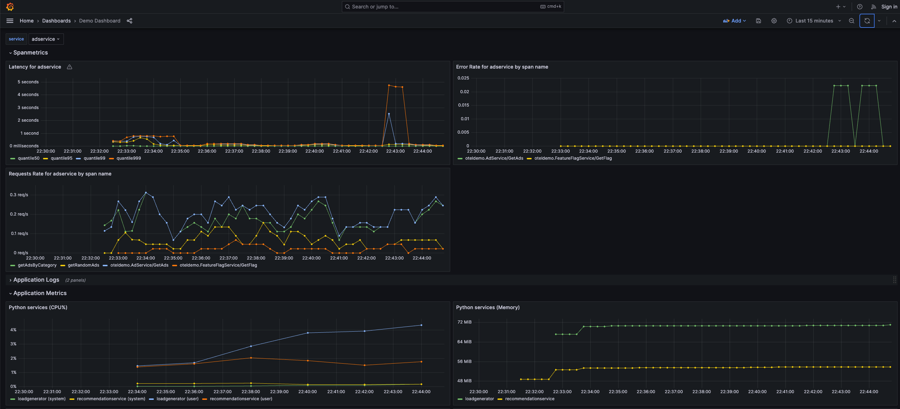
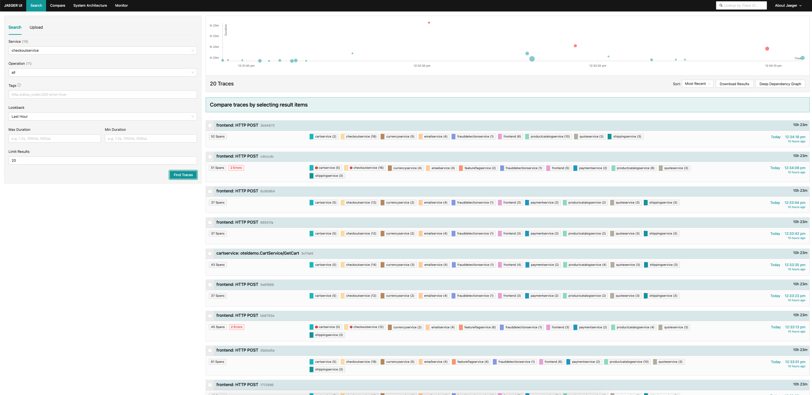
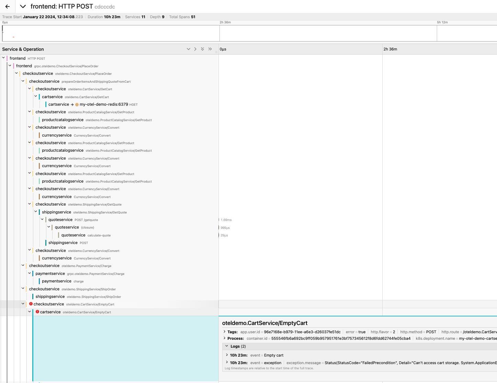

## Introduction
In this part you will be doing following tasks:
- Simulate memory leak scenario and how to use OpenTelemetry to identify it
- Simulate errors in adservice and cartservice and how to use OpenTelemetry to identify it

## Using Metrics and Traces to diagnose a memory leak

### Start the scenario
To run this scenario, you will need to deploy the demo application and enable the recommendationCache feature flag. You can do it via feature flags `https://app-8080-xxxx.devenv-testing.ap-ne-1.devnetcloud.com/feature`. Set recommendationCache to `1.0`.

### Diagnosis

The first step in diagnosing a problem is to determine that a problem exists. Often the first stop will be a metrics dashboard provided by a tool such as Grafana. We can see that CPU went up and that is causing higher latency to responde. Let's find out what's happenning. 

We know that we’re emitting trace data from our application as well, so let’s think about another way that we’d be able to determine that a problem exists.

By sorting by latency, we’re able to quickly find specific traces that took a long time. Clicking on a trace in the right panel, we’re able to view the waterfall view.

We can see that the recommendation service is taking a long time to complete its work, and viewing the details allows us to get a better idea of what’s going on.

### Confirming the Diagnosis

We can see in our waterfall view that the app.cache_hit attribute is set to false, and that the app.products.count value is extremely high.

Returning to the search UI, filter to recommendationservice in the Service dropdown, and search for app.cache_hit=true in the Tags box. Notice that requests tend to be faster when the cache is hit. Now search for app.cache_hit=false and compare the latency. You should notice some changes in the visualization at the top of the trace list.

Now, since this is a contrived scenario, we know where to find the underlying bug in our code. However, in a real-world scenario, we may need to perform further searching to find out what’s going on in our code, or the interactions between services that cause it.

## Using Metrics and Traces to diagnose an error in adservice and cartservice

### Start the scenario

To run this scenario, you will need enable the cartServiceFailure feature flag. You can do it via feature flags `https://app-8080-xxxx.devenv-testing.ap-ne-1.devnetcloud.com/feature`. Set `adServiceFailure` and `cartServiceFailure` to 0.55.

### Diagnosis
Like in the previous scenario the first stop will be a metrics dashboard provided by Grafana. You can see that error rate went up. 

Let's dig deeper. Based on the diagram CartService is being used by CheckoutService so let's see how CheckoutService is doing in Jaeger.

As you can see we are seeing some errors so let's start digging deeper to understand what exactly is happenning. Click on one of traces where you see errors. You will be redirected to the page which breaks down the trace shows the path taken by request step by step, service by service. However, most importantely if you click on one of the steps with red warning sign you will be able to see more detail why the step takes so long and what causes the issue.

In this case you can see that the issue is being caused not being able to connect to redis database. This was super easy to identify so now you can go and investigate why you can't connect to the database.

Using Metrics and Traces to diagnose a memory leak
https://opentelemetry.io/docs/demo/scenarios/recommendation-cache/

